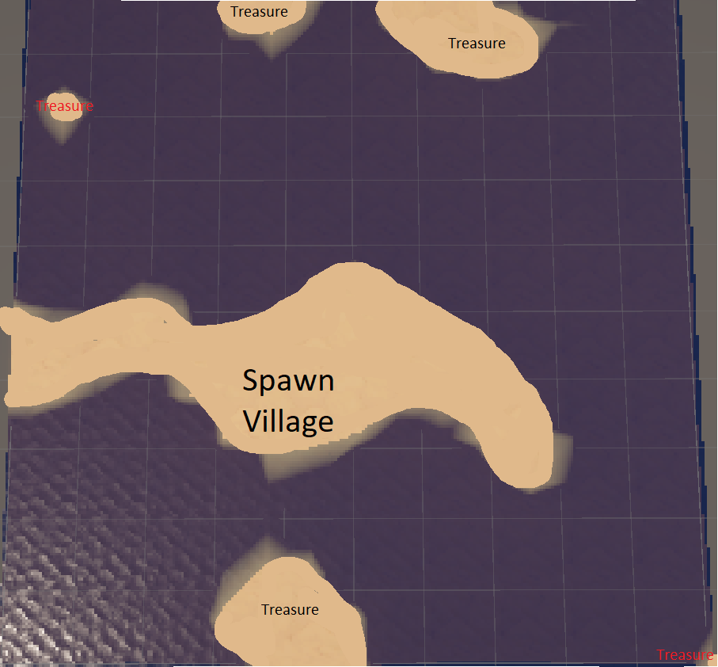

# 

## Numeric Properties
- Health : The base player health will be set to a standart 100 Hp like in most games. Damage will be decided based on this to make the game balanced, for example canoon projectiles will deal 100+ Dmg.

- Speed : The walking speed will be set to around 3, double the real life average walking speed. And running will be set to around 5. 

- Stamina : The base stamina will be set to 60, the player will lose 1 point each second of running. The player will recover 2 points each second of resting.

## Map Highlights 
- Some treasures will be placed on far islands that the player will have to discover.

- The regular loot will be placed near the spawn and near mission locations.

- The village will be placed near the spawn so the player could access its NPCs immediately.

## Main Behaviour
- Quest Giver : Stands in a set place and give the player quests on interaction.

- Tarver keeper : Lets the player pass the night.

- Goods Trader : Sells the player ammo, clothes, food etc.

- Enemy ships : Spawn randomly and attack the player if he gets too close.

- Enemies on land : Wait around treassures and attack the player if he gets too close, some are melee pirates, some are ranged pirates.

#### Advanced Behaviour
- When getting treasures - the melee and ranged attack the player together. On one hand the ranged enemies do more dmg with guns but the melee can overrun the player if not taken care of.

## Currency - In Game
The game currecy is Gold/Silver/Bronze the player finds at treasure locations.

#### Price examples
- Cannon Ball : 1G;
- Musket Bullets : 5 silver;
- Basic Armor : 2G;
- Good Armor : 4G;
- Planks (Ship Repair): 10 silver;
- Dye (For Sails): 10 silver;
- Swords: 1G;
ect.

## Data
The player starts with no understanding of the world, while doing quests the player learns more mechanics, how to navigate the world, and how to fight.

- The game is set as a top down (isometric) 3rd person. 

## Player Controls
The user controls the player directly using the mouse & keyboard.
I picked this type of control because its my favorite and in my opinion most players prefer it.w

# Strategies
The Strategies are based mostly on how fast the player wants to finish the game, if the player is willing to replay mission so such. 
- Better strategy : Grind a bit to get better loop & more gold to make the rest of the game easier.
- Worse strategy : Rush the game as fast as possible.

User experience wise there isnt a better/worse strategy, each player can play however he enjoys.
